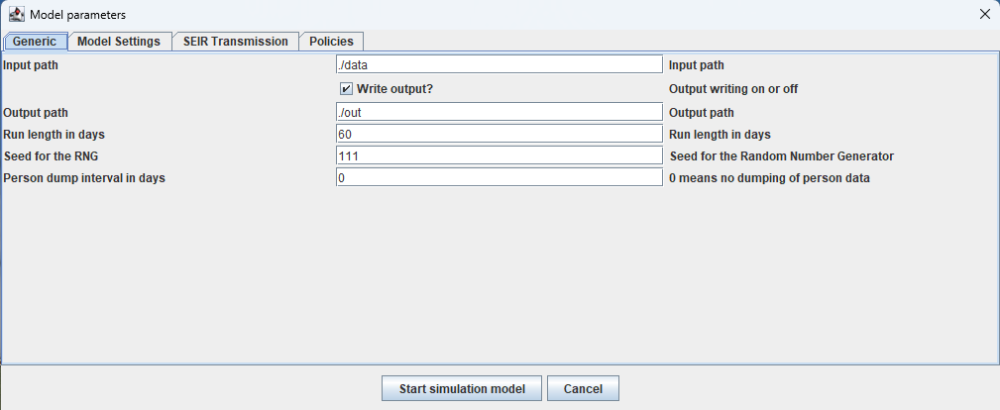

# MEDLABS
## Agent-Based Simulation for Disease Spread in Cities and Regions

## 1. Installing and running a medlabs study

### 1.1. Install Java

Make sure a Java version 17.0 or higher is installed on the computer, and can be reached from the command line / shell. Test with `java -version`:

```
java -version
openjdk version "17.0.2" 2022-01-18
OpenJDK Runtime Environment (build 17.0.2+8-86)
OpenJDK 64-Bit Server VM (build 17.0.2+8-86, mixed mode, sharing)
```

When the version is 17 or higher, Java can run the medlabs models.


### 1.2. Download the executable jar, and input files

Download the contents of the `jar` folder and unpack into a folder on disk, preferably one without spaces in the file path. It should have the following content:

```
|-- medlabs-full-2.2.0.jar
|-- default.properties
|-- data
    |-- placeholder.properties
```


### 1.3. Run the model interactively

Go into the folder of the jar file, and run it with:

```
java -jar medlabs-full-2.2.0.jar ./default.properties
```

It will use the file `default.properties` and read the information to find all other files needed to run the experiment. It will show a confirmation screen of the configuration in `default.properties`:



Final tweaks can be made here, after which the model runs in interactive mode.


### 1.4. Command line arguments

The running of the jar file takes two arguments:

```
java -jar medlabs-full-2.2.0.jar properties_file [batch|interactive] seed
```

The properties file name defaults to `/default.properties` where the `/` means that the properties file is searched for at the same place where the jar file resides. See the location of `default.properties` in the folder structure at section 1.2 above.

The second argument is `interactive` or `batch`, and defaults to `interactive`. When `batch` is chosen, the model runs without animation and without user input during the run. The batch run is explained below in section 1.5.

The third argument is the seed to use for the random number generators. In case of multiple runs that have to be stochastically different, a seed can be chosen on the command line. This overrides the seed in the properties file.


### 1.5. Batch run

It is possible to run an experiment without animation (which will also run a lot faster than the interactive model). When a model starts in batch mode, no animation or user input is requested. The `OutputPath` where all model output is placed, is appended with `-seed-###` where `###` is the seed value. In this way, many replications can be started in parallel by, e.g., calling (in Linux):

```
java -jar medlabs-full-2.2.0.jar ./exp4.properties batch 10 &
java -jar medlabs-full-2.2.0.jar ./exp4.properties batch 20 &
java -jar medlabs-full-2.2.0.jar ./exp4.properties batch 30 &
java -jar medlabs-full-2.2.0.jar ./exp4.properties batch 40 &
java -jar medlabs-full-2.2.0.jar ./exp4.properties batch 50 &
```

Now, 5 experiments will be started in parallel using the same properties file but a different random seed for the experiment. Under Windows, something similar can be done using a `.BAT` file that starts 5 parallel command prompts to run the 5 medlabs-heros experiments.

