# MEDLABS
# Agent-Based Simulation for Disease Spread in Cities and Regions

## 5. medlabs code

### 5.1. Generic setup of the code

The code has been developed in Java, and builds heavily on the DSOL simulation library for fast and efficient execution of large-scale object-oriented simulation models. The medlabs library contains the logic for executing activity-based disease modeling in cities. See the [literature list](6-literature.md) for further references for the medlabs library and the DSOL simulation library. 

A partial dependency stack of the of the libraries for medlabs can be depicted as follows:

<table>
  <tr><td>MEDLABS disease transmission library (https://github.com/averbraeck/medlabs)</td></tr>
  <tr><td>DSOL simulation library (https://github.com/averbraeck/dsol / https://simulation.tudelft.nl)</td></tr>
  <tr><td>djutils (https://github.com/averbraeck/djutils / https://djutils.org)</td></tr>
  <tr><td>djunits (https://github.com/averbraeck/djunits / https://djunits.org)</td></tr>
  <tr><td>djutils-base (https://github.com/averbraeck/djutils-base / https://djutils.org)</td></tr>
</table>


### 5.2. Runnable jar

There is an 'executable jar' in the folder `jar` that contains the medlabd library and demo plus all libraries on which it is dependentAfter copying the contents of that file to a folder on your computer (preferably without spaces in the entire file path), you can start the interactive application with:

```
java -jar medlabs-full-2.2.0.jar
```

See the [installation instructions](1-install.md) for more information about installation and running the application in batch mode.


### 5.3. Java version

In order to just *run* a model, Java version 17 or higher needs to be installed on your computer. The library is typically used with an openjdk version 17, because it has been tested with Java 17. The code probably runs with later versions of Java, but this is not guaranteed. Note that if you plan to work with the code and run from an IDE, installing java is often not needed, since many IDEs come with a built-in version of Java.

For **Windows**, install OpenJDK version 17, 21 or 25 (an LTS = Long Term Support version). Download the zip for Java 17, 21 or 25 at [https://jdk.java.net/archive/](https://jdk.java.net/archive/) for your operating system. All code has been developed and tested with Java version 17, but should run using later Java versions as well. The best way to install Java is to unpack the Java zip in a folder without spaces in the folder name, e.g., C:\app\jdk17. Make sure to add Java to the current 'Path' (on Windows-10 or Windows-11 go to Windows Settings - System - About and click 'Advanced Systems Settings' on the right. Click 'Environment Variables' in the 'Systems Properties' screen. Edit the 'Path' entry and add `C:\app\jdk17\bin` as an entry (adapt for your chosen location and Java version). You can move the entry to before 'C:\Windows\system32' to override a Java client in Windows. Add or modify an entry `JAVA_HOME` and set the value to `C:\app\jdk17` (adapt for your chosen location and Java version). You can test whether Java works by opening a Command prompt (CMD) and typing `java -version`. If Java responds with with the correct version, the installation has succeeded.

For **MacOS**, install OpenJDK version 17, 21 or 25, e.g., using the following instruction: [https://stackoverflow.com/questions/69875335/macos-how-to-install-java-17](https://stackoverflow.com/questions/69875335/macos-how-to-install-java-17) or [https://docs.oracle.com/en/java/javase/17/install/installation-jdk-macos.html](https://docs.oracle.com/en/java/javase/17/install/installation-jdk-macos.html) or [https://www.codejava.net/java-core/install-openjdk-17-on-macos](https://www.codejava.net/java-core/install-openjdk-17-on-macos).

For **Debian / Ubuntu** versions of Linux, use the command `sudo apt install openjdk-17-jdk` to install OpenJDK version 17. Adapt for later versions of Java.

For **CentOS / RedHat** versions of Linux, use the command `sudo yum install java-17-openjdk-devel` or `sudo dnf install java-17-openjdk-devel` to install OpenJDK version 17. If you want to know which java installations are available on CentOS / RedHat, type: `yum search jdk` or `dnf search jdk`, and choose the one you want to install.


### 5.4. IDE: Eclipse

Eclipse is an open-source development environment for, amongst others, Java projects. The Eclipse development environment is available for Windows, Mac, and Linux. You can find Eclipse at [https://www.eclipse.org/](https://www.eclipse.org/). Probably the Eclipse IDE for Java developers fits best: [https://www.eclipse.org/downloads/packages/release/2025-09/r/eclipse-ide-java-developers](https://www.eclipse.org/downloads/packages/release/2025-09/r/eclipse-ide-java-developers). There are versions for Windows, MacOS and Linux, for multiple hardware architectures.

medlabs is dependent on several external libraries to function properly. The easiest way to run a medlabs executable is to have Apache Maven figure out what libraries are needed for medlabs to function. [Apache Maven](https://maven.apache.org/) is a flexible and open source build tool that, amongst a large set of functions, enables programmers to automatically resolve dependencies and easily build their project. The Eclipse Java installations all contain Maven, making it really easy to set-up, develop, and run a simulation for medlabs. 

To create a project in which you can play with medlabs, install and start Eclipse. The first time, create a blank project at a location where you want to store the Eclipse Java project, and press `Launch`:

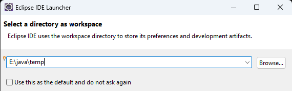

In Eclipse, load the git for medlabs as a project. The easiest way is to load a project is go into github for the repository at [https://github.com/averbraeck/medlabs](https://github.com/averbraeck/medlabs). Click on `<> Code` and use the COPY button next to the git address:

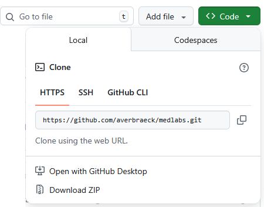

Now the complete link for github is copied to the clipboard. In Eclipse, use `File - Import - Git - Projects from Git`:

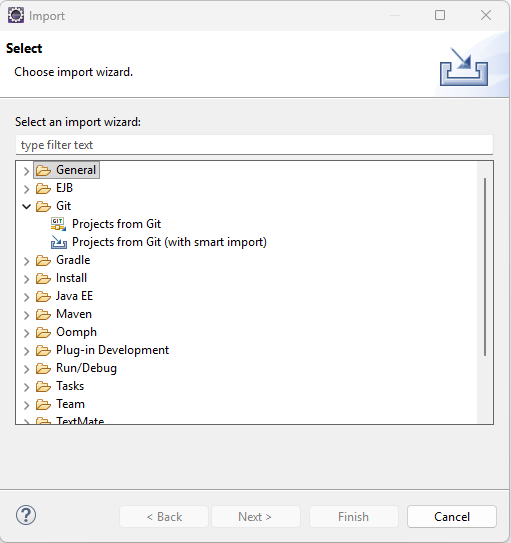

Press `Next` and choose `Clone URI`:

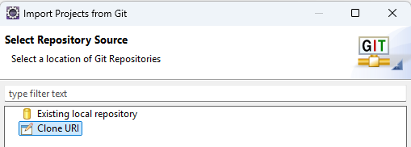

Press `Next` again, and all information from the clipboard will be pasted into the fields:

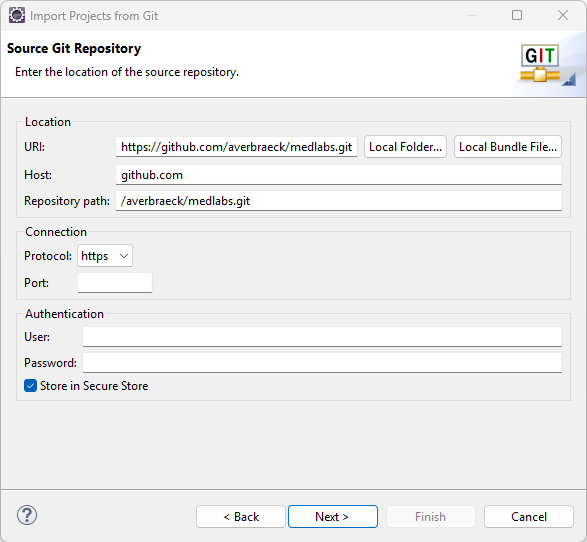

Press `Next` again, and it will ask which git branch to checkout. use `main`:

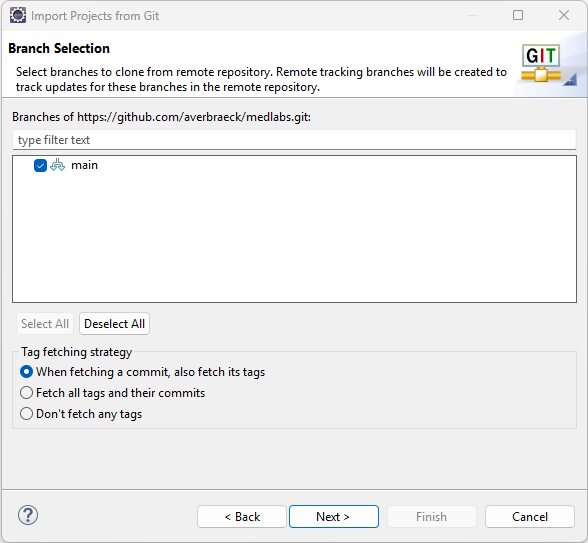

Press `Next` again, and choose where to store the git. Note that the **git** folder is a different folder from your **project** folder. The git-folder is the place where a clone from the code from github resides; the project folder is the place where your settings, libraries, plugins, and other project-dependent information resides that is **not** on github.

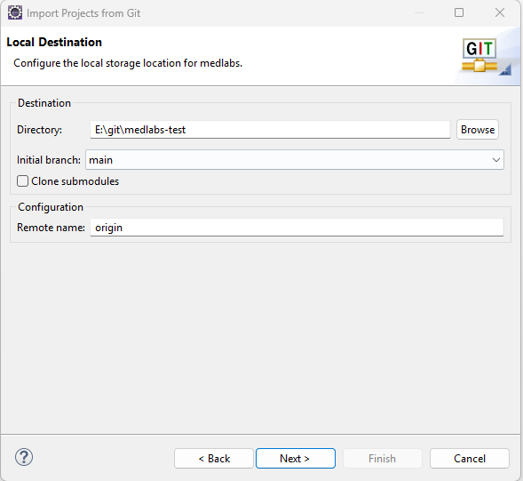

Press `Next` again, and ask it to import existing Eclipse projects:

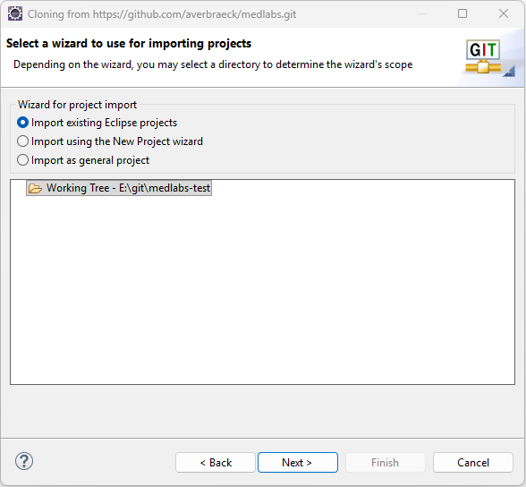

Press `next` again, and make sure all medlabs-related project are imported:

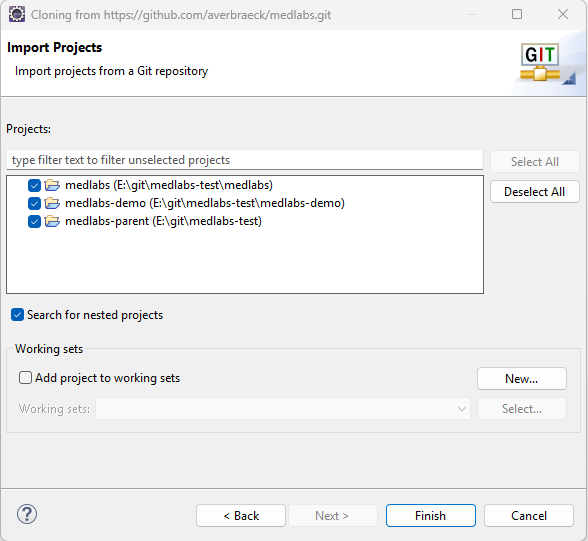

Press `Finish`, and the projects will be imported in the Eclipse IDE. Maven will download any libraries that are needed automatically to your computer. The project has now been loaded. In case you have the `Project Explorer` tab at the top left, it can be nice to open a `Java Package Explorer` as well using `Window - Show View - Other`:

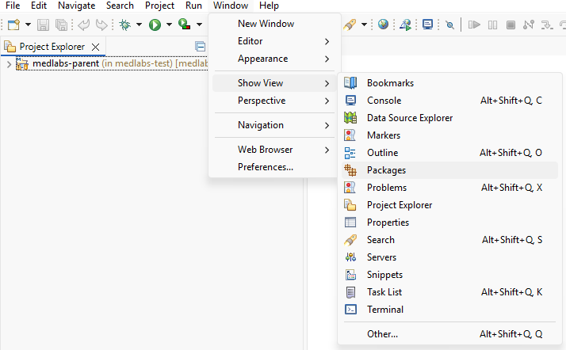

and then select `Java - Package Explorer - Open`:

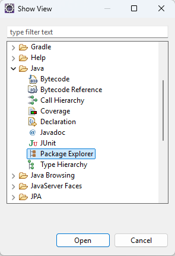

The package explorer view might be a bit easier for navigation than the project explorer view, although they are very similar:

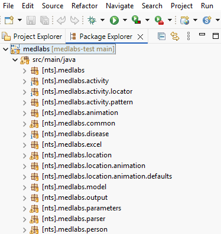

In case you want to have your own version of medlabs that you can maintain on github, fork the project on github, and clone your forked project instead. The permissive license of medlabs and all libraries on which medlabs is dependent allows you to use the library for any purpose, and create your own version based on the available code.
